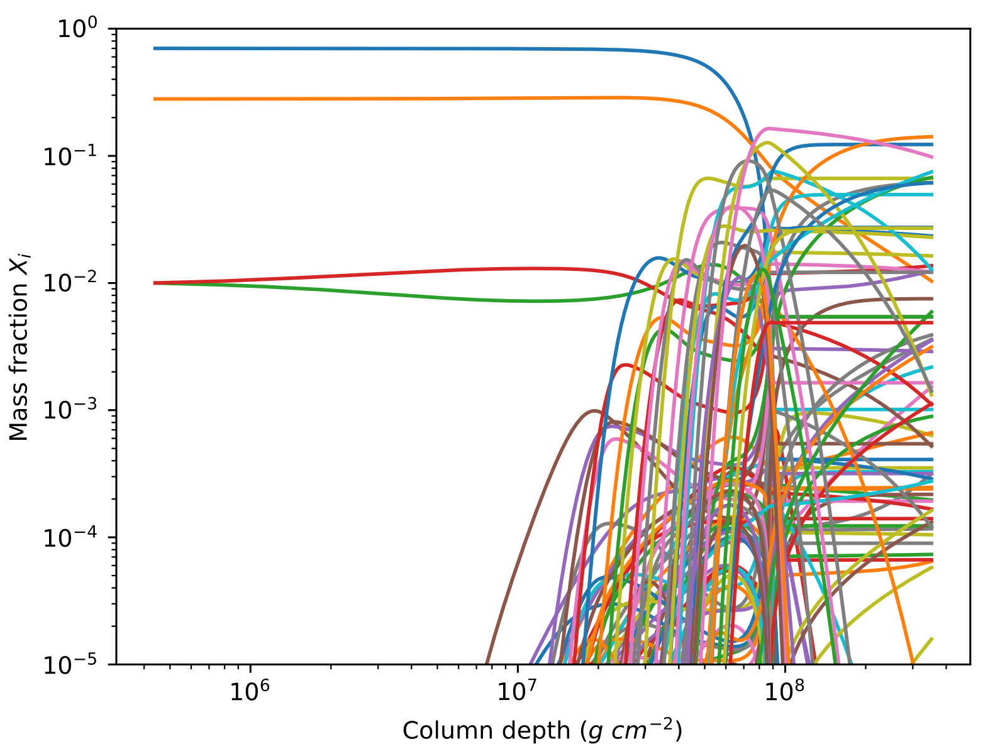

A one-zone model of rp-process burning on accreting neutron stars. The code uses the [REACLIB](https://groups.nscl.msu.edu/jina/reaclib/db/) reaction database. To compile the net, eos, and kappa modules with cython (`pip install cython`), use

`python setup.py build_ext --inplace`

The code `steady.py` calculates the profile of a steady burning envelope (as in [Schatz et al. 1999](http://adsabs.harvard.edu/abs/1999ApJ...524.1014S)).

`burst.py` calculates a one-zone X-ray burst.

Not included:

* neutrino losses
* screening
* density-dependent weak rates
